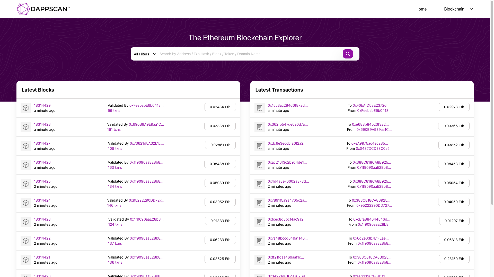

# Dappscan - Blockchain Block Explorer

## Overview

**Dappscan** is a versatile blockchain block explorer that allows users to explore various aspects of a blockchain network. You can use this tool to access information about the blockchain network itself, explore individual blocks, inspect transactions within a block, and examine specific accounts. Dappscan is designed to be user-friendly, efficient, and is built using Vite with TypeScript.

## Features

Dappscan provides the following key features:

1. **Blockchain Network Information**: Get an overview of the connected blockchain network, including its name, chain ID, and other relevant details.

2. **Block Explorer**: Explore individual blocks on the blockchain. View details such as block height, timestamp, hash, and the number of transactions in the block.

3. **Transaction Inspection**: Inspect transactions within a specific block. Retrieve transaction details, including sender and receiver addresses, transaction hash, gas usage, and more.

4. **Account Lookup**: Search for specific accounts by address. Get insights into an account's balance, transaction history, and more.

## Getting Started

To run Dappscan locally for development or testing:

1. Clone this repository.
2. Navigate to the project directory and run `yarn` to install the necessary dependencies.
3. Configure the AlchemySDK or your preferred blockchain provider to connect to the desired blockchain network.
4. Update the Vite configuration as needed, ensuring it points to your chosen blockchain provider.
5. Start the development server with `yarn dev`.

## Usage

Once the development server is running, you can access Dappscan by opening your web browser and navigating to the provided URL (usually `http://localhost:3000`).

## Technology Stack

Dappscan is built with the following technologies:

- **Vite**: A fast build tool that provides a seamless development experience.
- **TypeScript**: A statically typed superset of JavaScript, adding type safety to the codebase.
- **AlchemySDK**: A blockchain developer platform that simplifies interaction with blockchain networks.
- **HTML/CSS**: For structuring and styling the user interface.

## Contributing

Contributions to Dappscan are highly encouraged. Whether you want to add new features, fix bugs, or improve documentation, your contributions are welcome. Please fork this repository, make your changes, and submit a pull request.

## License

This project is licensed under the MIT License. For more information, see the [LICENSE](LICENSE) file.

## Acknowledgments

I would like to express my gratitude to the team at Alchemy for providing a robust and user-friendly blockchain developer platform. Additionally, I acknowledge the support from the Web 3 bootcamp by MEST Africa and Mowblox, sponsored by MasterCard, which inspired the creation of Dappscan.

---

**Dappscan** empowers users to explore blockchain networks with ease. Thank you for your interest, and we look forward to your contributions!
